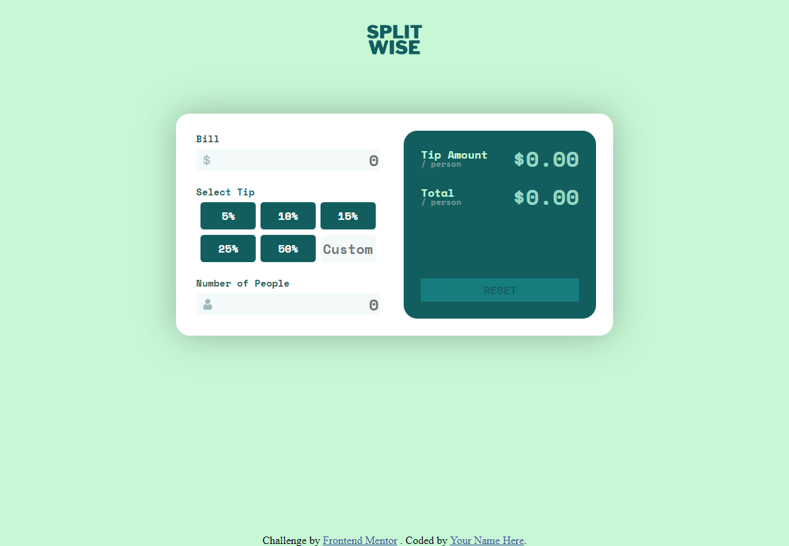

# Split Wise

This is a tip calculator app. It allows users to enter the total amount of their bill, select a tip percentage, select amount of people and calculate the total amount including tip.

## Table of contents

- [Split Wise](#split-wise)
  - [Table of contents](#table-of-contents)
  - [Overview](#overview)
    - [Screenshot](#screenshot)
    - [Links](#links)
  - [My process](#my-process)
    - [Built with](#built-with)
    - [Challenges](#challenges)
    - [Continued development](#continued-development)
    - [Useful resources](#useful-resources)
  - [Author](#author)
    - [Check out my other Projects](#check-out-my-other-projects)
  - [Acknowledgement](#acknowledgement)

## Overview

### Screenshot

### Links

- Live Site URL: [Visit Live Site](https://splitwise-yobe.onrender.com/)

## My process

### Built with

- **HTML5** Semantic markup
- **CSS** custom properties
- **SASS/SCSS**
- **Node.js** Object oriented programming
- **Express** for routing
- **EJS** for templating
- **Render** for Web service hosting
- **Mobile-first** workflow
- **Canva** for image editing

### Challenges

Decided to go with SASS instead of css. I was challenged with learning a new way to organize my css.

I had some challenge on writing the script becouse there was a lot of variable to keep an eye on for example changing the colors of the text when clicking on a checkbox. 

### Continued development

In the future i will optimize my Sass code to be more efficent. I want to add more modules. 

I will abstract my code better in future, Encapsulate the calculator in a class

### Useful resources

- [Sass docs](https://sass-lang.com/documentation/) - This helped me for understanding the syntax of the Sass language and to better abstract my Sass
- [MDN](https://developer.mozilla.org/en-US/) - Looked up the MDN for general questions

## Author

- Website -  [@DanielVidarHolm](https://danielholm.me/)
- Frontend Mentor - [@DanielVidarHolm](https://www.frontendmentor.io/profile/DanielVidarHolm)
- Twitter - [@DanielVidarHolm](https://twitter.com/DanielVidarHolm)
- Linked-in - [@DanielVidarHolm](https://www.linkedin.com/in/danielvidarholm/)
- Company Website - [@DH Web Design](https://dhwebdesigns.com/)

### Check out my other Projects

- [Card game](https://github.com/DanielVidarHolm/CardGame)
- [Heroes of might and magic Api](https://github.com/DanielVidarHolm/homm3-api)

## Acknowledgement

- No Acknowledgents for this project
